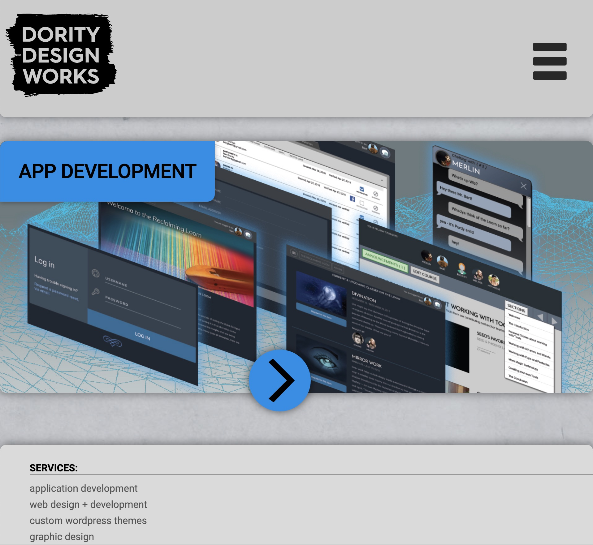

# DDWorks
Public website for Dority Design Works.  This is a portfolio website that features my client projects that includes graphic design, web design and application development. Technologies include Angular 2+, Javascript, PHP, HTML, CSS, Greensock Animation, JQuery, MongoDB, MySQL, Heroku, AWS.



# Table of contents
1. [Installation](#Installation)
2. [Usage](#Usage)
3. [License](#License)
4. [Features](#Features)
5. [Technology](#Technology)
6. [Credits](#Credits)
<a name="Installation"></a>
## Installation
```sh
Have PHP running on Apache (easiest way is to use MAMP).
```
<a name="Usage"></a>
## Usage
```sh
View index.php in a browser
```
<a name='License'></a>
## License
[](https://lbesson.mit-license.org/)
<a name="Features"></a>
## Features
1. Pub-Sub Javascript Design Pattern
2. Responsive Design - uses CSS media queries to adjust for mobile, tablet and desktop layouts.

<a name="Technology"></a>
## Technology
1. Javascript
2.  PHP
<a name="Credits"></a>
## Credits
Bart Dority

**on github:** <a href='github.com/b0rgBart3'>b0rgBart3</a>

[](https://github.com/remarkablemark)

Email: borgBart3@gmail.com
